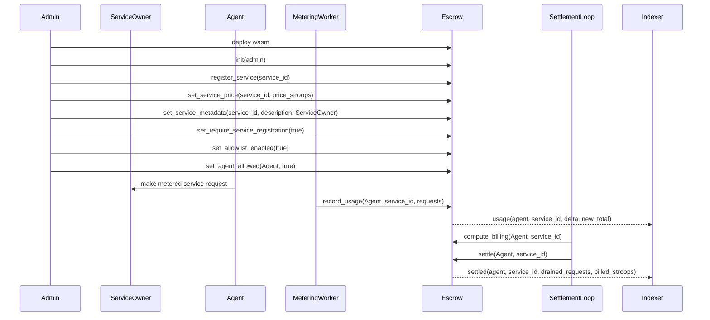

# Escrow Record-Settle Integration Guide

This guide shows how an integrator wires the AgentPay escrow contract into an
off-chain metering system: initialize the contract, configure a service, record
usage, compute the outstanding bill, and settle the balance.

## Actors

| Actor | Contract role | Typical off-chain responsibility |
| --- | --- | --- |
| Admin | Calls all configuration and settlement entrypoints. | Owns deployment, service registration, pricing, pause controls, allowlists, and the settlement loop key. |
| Service owner | Stored in `ServiceMetadata.owner`. | Operates the metered service and receives off-chain settlement information. |
| Agent | Identifies the consumer whose usage is being recorded. | Makes requests to the service and can be allowlisted before usage is accepted. |
| Metering worker | Calls `record_usage`. | Converts service request logs into contract usage deltas. |
| Settlement loop | Calls `compute_billing` and `settle`. | Prices accumulated usage, executes payment off-chain or through a paired token flow, and indexes settlement timestamps. |
| Indexer | Reads events and view methods. | Tracks `usage`, `settled`, and `paused` events plus storage-backed views. |

## End-to-end flow



Configuration calls write persistent storage but do not emit events. Indexers
should combine the emitted `usage`, `settled`, and `paused` events with read
methods such as `get_service_price`, `get_service_metadata`,
`is_service_registered`, `is_agent_allowed`, and `get_last_settlement`.

## Deployment and initialization

After deployment, call `init(admin)` exactly once. It requires
`admin.require_auth()` and rejects a second initialization with
`EscrowError::AlreadyInitialized (#1)`.

The unit tests register a contract and initialize it with the generated
`EscrowClient` like this:

```rust
use escrow::{Escrow, EscrowClient};
use soroban_sdk::{testutils::Address as _, Address, Env};

let env = Env::default();
env.mock_all_auths();

let contract_id = env.register_contract(None, Escrow);
let client = EscrowClient::new(&env, &contract_id);
let admin = Address::generate(&env);

client.init(&admin);
assert_eq!(client.get_admin(), Some(admin));
```

Production deployments should use the real admin signing key instead of
`mock_all_auths()`.

## Register and price a service

Use a stable `Symbol` as the service identifier. The admin can register the
service, set a per-request price in stroops, and store metadata for dashboards
or settlement reporting.

```rust
use soroban_sdk::{Address, String, Symbol};

let service_id = Symbol::new(&env, "infer");
let service_owner = Address::generate(&env);

client.register_service(&service_id);
client.set_service_price(&service_id, &500i128);
client.set_service_metadata(
    &service_id,
    &String::from_str(&env, "Inference API"),
    &service_owner,
);

assert!(client.is_service_registered(&service_id));
assert_eq!(client.get_service_price(&service_id), 500i128);
assert_eq!(
    client.get_service_metadata(&service_id).unwrap().owner,
    service_owner
);
```

`set_service_price` accepts zero as a free service and rejects negative prices.
Metadata descriptions are capped in the contract comments at 256 UTF-8 bytes to
bound storage cost.

## Optional strict modes

Strict service registration and agent allowlisting are disabled by default. Turn
them on when the deployment must reject unknown services or unapproved agents.

```rust
let agent = Address::generate(&env);

client.set_require_service_registration(&true);
client.set_allowlist_enabled(&true);
client.set_agent_allowed(&agent, &true);

assert!(client.is_service_registration_required());
assert!(client.is_allowlist_enabled());
assert!(client.is_agent_allowed(&agent));
```

When strict registration is enabled, `record_usage` fails with
`EscrowError::ServiceNotRegistered (#7)` for unknown services. When the
allowlist is enabled, `record_usage` fails with `EscrowError::AgentNotAllowed
(#10)` for agents whose entry is absent or false.

Admins can also call `set_min_requests_per_call` and `set_max_requests_per_call`
to bound each usage delta. Calls outside those bounds fail with
`RequestsBelowMinPerCall (#9)` or `RequestsExceedsMaxPerCall (#8)`.

## Record usage

The metering worker should pass the request delta for one `(agent, service_id)`
pair. `record_usage` rejects zero deltas, paused contracts, disabled services,
unregistered services under strict mode, and disallowed agents under allowlist
mode.

```rust
let first = client.record_usage(&agent, &service_id, &40u32);
assert_eq!(first.requests, 40);

let second = client.record_usage(&agent, &service_id, &60u32);
assert_eq!(second.requests, 100);
assert_eq!(client.get_usage(&agent, &service_id), 100);
```

The returned `UsageRecord.requests` is the new accumulated total for that pair,
not the delta. The contract also increments lifetime analytics counters:

```rust
assert_eq!(client.get_total_usage_by_agent(&agent), 100);
assert_eq!(client.get_total_requests_all_time(), 100u64);
```

Each successful `record_usage` emits:

```text
usage(agent, service_id, delta_requests, new_total_requests)
```

Indexers should use the event's `delta_requests` for append-only activity feeds
and `new_total_requests` for reconciling the current outstanding balance.

## Compute and settle

`compute_billing(agent, service_id)` is read-only. It returns
`accumulated_requests * price_per_request`, saturating at `i128::MAX` on
overflow rather than panicking.

```rust
let billed = client.compute_billing(&agent, &service_id);
assert_eq!(billed, 50_000i128);
```

`settle(agent, service_id)` is admin-gated. It recomputes the bill, resets the
pair's accumulated usage counter to zero, stores the ledger timestamp in
`LastSettlement`, emits a `settled` event, and returns the billed amount in
stroops. The contract does not hold or transfer token balances; the settlement
loop must execute the payment through the paired off-chain or token flow.

```rust
let settled_amount = client.settle(&agent, &service_id);
assert_eq!(settled_amount, 50_000i128);
assert_eq!(client.get_usage(&agent, &service_id), 0);
assert!(client.get_last_settlement(&agent, &service_id).is_some());
```

Each successful settlement emits:

```text
settled(agent, service_id, drained_requests, billed_stroops)
```

The lifetime counters are not reset by `settle`, so dashboards can show both
current outstanding usage and all-time usage.

## Pause and emergency controls

The admin can pause and unpause state-changing flows:

```rust
client.pause();
assert!(client.is_paused());

client.unpause();
assert!(!client.is_paused());
```

`pause()` and `unpause()` emit:

```text
paused(true_or_false)
```

While paused, `record_usage` and `settle` fail with
`EscrowError::ContractPaused (#4)`. Admin configuration calls remain available
so operators can fix service registration, allowlist, pricing, or ownership
state before resuming.

Admins can disable a registered service without deleting its price, metadata, or
usage history:

```rust
client.set_service_disabled(&service_id, &true);
assert!(client.is_service_disabled(&service_id));
```

`record_usage` fails with `EscrowError::ServiceDisabled (#12)` for a disabled
service.

## Indexing checklist

Use this minimal checklist for an integration dashboard or settlement observer:

- Index `usage(agent, service_id, delta_requests, new_total_requests)`.
- Index `settled(agent, service_id, drained_requests, billed_stroops)`.
- Index `paused(true_or_false)`.
- Read `get_usage(agent, service_id)` before settlement and after settlement for
  reconciliation.
- Read `get_service_price(service_id)` and `get_service_metadata(service_id)`
  for pricing and owner display.
- Read `get_total_usage_by_agent(agent)` and `get_total_requests_all_time()` for
  lifetime analytics.
- Read `get_last_settlement(agent, service_id)` to detect stalled settlement
  loops.
- Read `is_service_registration_required`, `is_allowlist_enabled`,
  `is_agent_allowed(agent)`, and `is_service_disabled(service_id)` when a usage
  call is rejected.

## Security notes

- Keep the admin key separate from the metering worker if possible. Only the
  admin can configure pricing, strict modes, pause controls, metadata, service
  disabled state, and settlement.
- Enable strict registration before accepting production usage if unknown
  service IDs should be rejected.
- Enable the allowlist before production metering if only approved agents should
  be billable.
- Keep the settlement loop idempotent around returned values: `settle` resets
  usage after computing the billed amount, so retries should first inspect
  `get_usage` and `get_last_settlement`.
- Treat `compute_billing` as advisory until `settle` succeeds, because new
  `record_usage` calls can increase the balance between the read and the
  settlement transaction.
